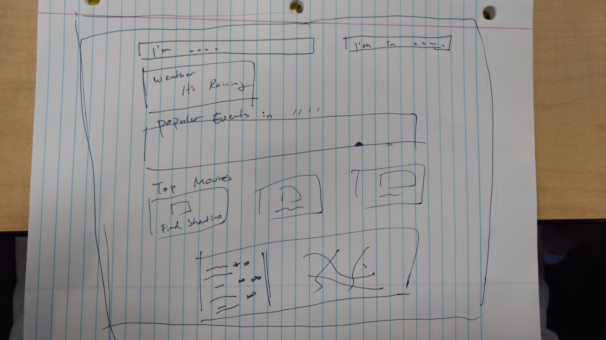

# Right Here, Right Now

Live Demo: https://conditionschange.github.io/Right-Here-Right-Now/

## Title:
I'm Bored...

## Team Members:
Eric Cooper, Kevin Cruz, Namho Kim

## Project Description 
User is bored and looking for something to do. User inputs location and something they might be interested in doing. Using various APIs, the app will pull up events, restaurants, movies, and other interesting happening in the area. It will also pull up the weather so that user can appropriately plan. 

## Sketch

## APIs to be Used:
Google Maps, SeatGeek, OpenWeather, Fandango

## Rough Breakdown of Tasks
Backend APIs
Kevin - Weather
Eric - SeatGeek
Namho - Fandango
Together - Google Maps

Frontend
TO BE DETERMINED

Backend Logic
TO BE DETERMINED 

Git management
TO BE DETERMINED

